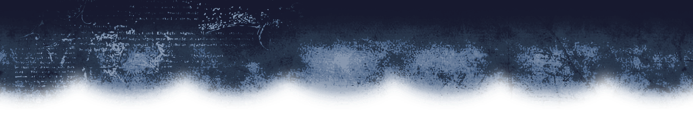
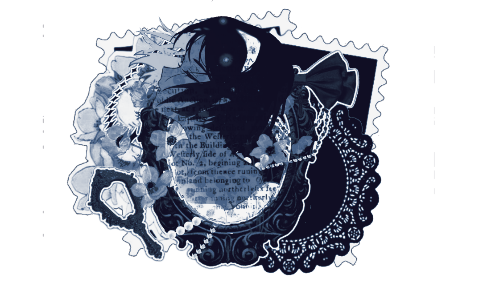

    

              
 <td>$${\color{lightblue}\verb|✦|}$$</td>

  ${\textsf{\color{#637997}please recommend me songs, characters, or tell me your favorite artist singer on my atabook! }}$ 

 }}$ [here.](https://archiveofourown.org/works/69474491?view_adult=true)

  

<p align=center

